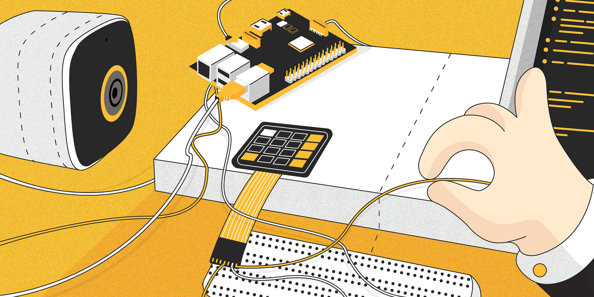
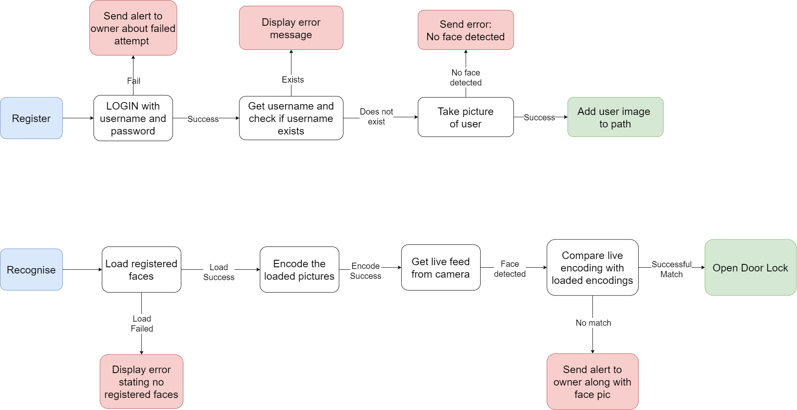

# Smart Door Face Recognition 🚪

This is a project that is done using 👇🏻
* face-recognition library
* solenoid lock
* raspberry pi-4
* Logitech webcam
* 5v relay module
* telegram 
* Tkinter (gui) library 

Here is the flowchart for the working of the smart door 🔮

> ❕ Note: Make sure to enter your telegram bots API key and the telegram ` chat_id ` of the person who will receive the telegram message from the bot.

